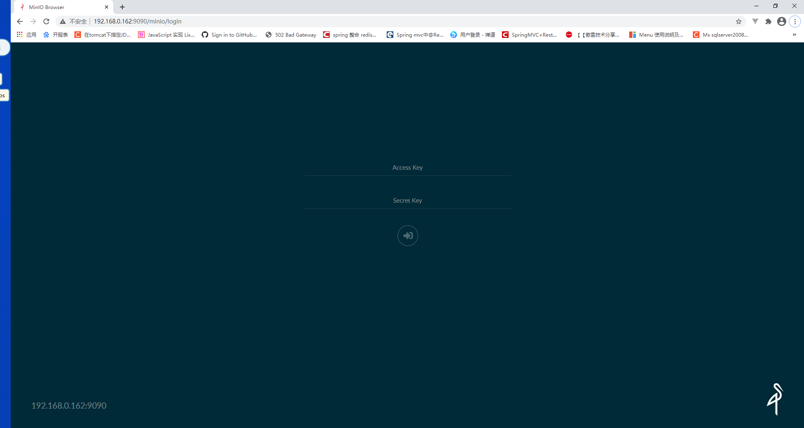
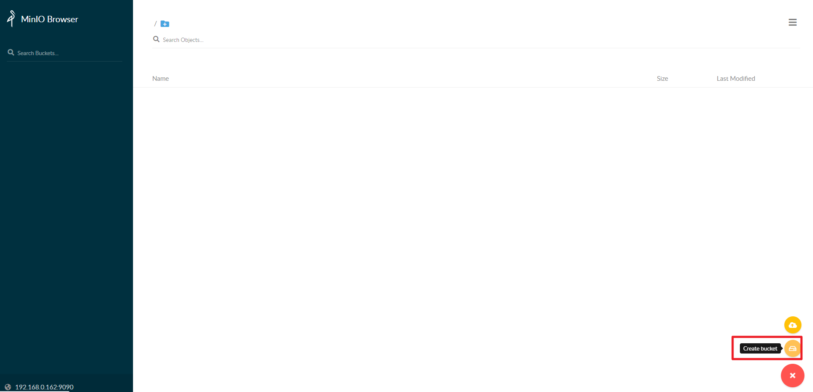
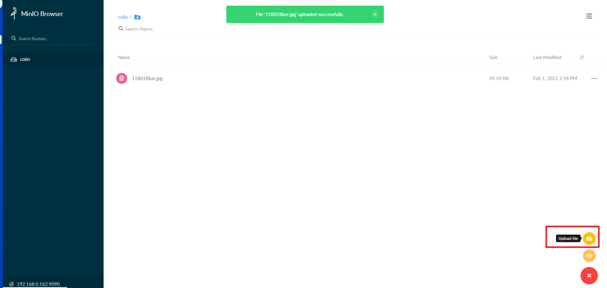
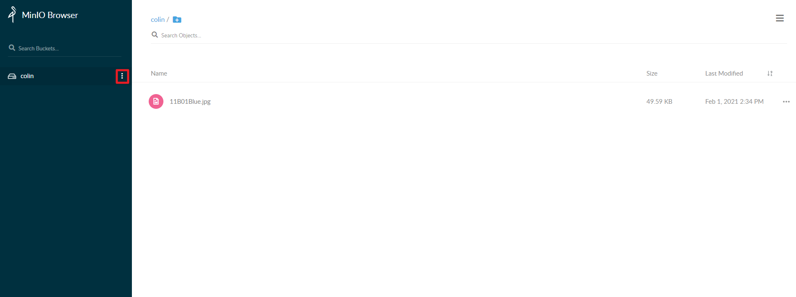
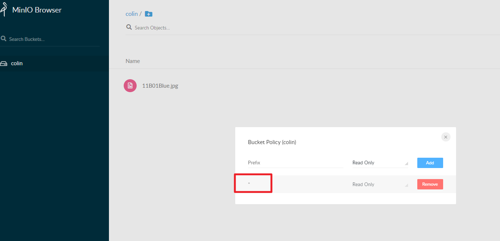

## Minio分布式文件系统

### 一、前言

​	MinIO 是在 Apache License v2.0 下发布的对象存储服务器。 它与 Amazon S3 云存储服务兼容。 它最适合存储非结构化数据，如照片，视频，日志文件，备份和容器/ VM 映像。 对象的大小可以从几 KB 到最大 5TB。

​	MinIO 可以单节点部署也支持集群部署，下面以单节点方式，使用docker安装部署。

### 二、安装部署

#### 2.1 、首先安装docker

步骤

```shell
1、检查内核版本，必须是3.10及以上
uname -r
2、安装docker
yum install docker
3、输入y确认安装
4、启动docker
[root@localhost ~]# systemctl start docker
[root@localhost ~]# docker -v
Docker version 1.12.6, build 3e8e77d/1.12.6
5、开机启动docker
[root@localhost ~]# systemctl enable docker
Created symlink from /etc/systemd/system/multi-user.target.wants/docker.service to /usr/lib/systemd/system/docker.service.
6、停止docker
systemctl stop docker
```

docker常用命令&操作

| 操作 | 命令                                            | 说明                                                     |
| ---- | ----------------------------------------------- | -------------------------------------------------------- |
| 检索 | docker  search 关键字  eg：docker  search redis | 我们经常去docker  hub上检索镜像的详细信息，如镜像的TAG。 |
| 拉取 | docker pull 镜像名:tag                          | :tag是可选的，tag表示标签，多为软件的版本，默认是latest  |
| 列表 | docker images                                   | 查看所有本地镜像                                         |
| 删除 | docker rmi image-id                             | 删除指定的本地镜像                                       |

#### 2.2 、拉取MinIo镜像

``` shell
docker pull minio/minio
```

#### 2.3、 查看镜像

``` shell
docker images
```

#### 2.4、 运行MinIo镜像

/opt/docker-data/minio/data为宿主机的目录，-v /opt/docker-data/minio/data:/data 表示将宿主机的/opt/docker-data/minio/data目录挂载到容器的/data目录

/opt/docker-data/minio/config同上

``` shell
docker run -p 9090:9000 --name minio-server \
  -e "MINIO_ACCESS_KEY=admin" \
  -e "MINIO_SECRET_KEY=admin123456" \
  -v /opt/docker-data/minio/data:/data \
  -v /opt/docker-data/minio/config:/root/.minio \
  -d minio/minio server /data
```

#### 2.5、查看正在运行的容器

``` shell
# 查看正在运行的容器
docker ps
# 查看容器日志
docker logs 488117d0ce80
```

#### 2.6、 浏览器访问

http://192.168.0.162:9090/

输入运行MinIo是指定的MINIO_ACCESS_KEY和MINIO_SECRET_KEY



#### 2.7、创建桶&上传文件

​	进入系统后，先点击右下角的“+”按钮，创建一个文件桶（输入名称后，回车即可），再上传文件到这个文件桶中。Create bucket（创建文件桶）、Upload file（上传文件），这里我创建了一个桶colin，上传了一张图片





#### 2.8、设置桶访问策略



前缀设置为 * ，后边根据需要选择只读、只写、读写；

如需通过浏览器预览上传的图片，前缀设置为 * ，后边选择只读或者读写，即可通过浏览器直接预览（如果是通过java等客户端上传的文件，注意设置contentType）

http://192.168.0.162:9090/colin/11B01Blue.jpg



#### 2.9、 docker容器操作

``` shell
# 查看运行中的容器
docker ps
# 停止运行中的容器
docker stop  容器的id
# 查看所有的容器
docker ps -a
# 启动容器
docker start 容器id
# 删除一个容器
docker rm 容器id
```

